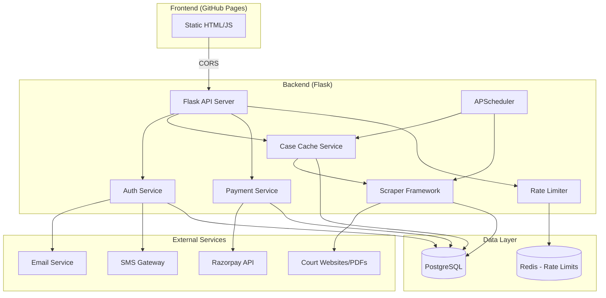
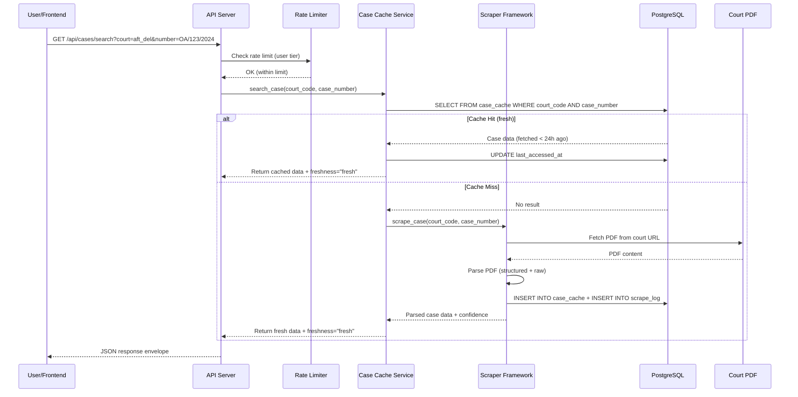
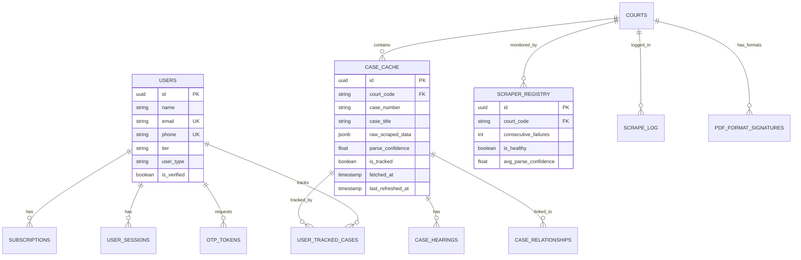

# Design Document: Nyaya Sutra Backend API

## Overview

The Nyaya Sutra Backend API is a Flask-based REST service that powers the legal case tracking portal. It provides passwordless authentication (OTP + JWT), on-demand court case scraping with smart caching, tier-based access control, subscription management via Razorpay, and background job scheduling for case refresh and cache cleanup.

The system follows a **fetch-on-demand** architecture: cases are only scraped from court PDFs when a user searches for them, then cached for shared benefit. Tracked cases are auto-refreshed in the background. The scraper framework uses an **anti-fragile** design with raw data preservation, confidence scoring, and format signature detection to gracefully handle court PDF format changes.

### Key Design Decisions

| Decision | Choice | Rationale |
|----------|--------|-----------|
| Auth mechanism | OTP + JWT (passwordless) | Indian users prefer phone/email OTP; no password management burden |
| Caching strategy | Fetch-on-demand, shared cache | Avoids scraping entire court databases; one user's search benefits all |
| Scraper resilience | Raw data + confidence scoring | Court PDFs change without notice; preserving raw data allows re-parsing |
| Background jobs | APScheduler (in-process) | Simpler deployment than Celery for initial scale; can migrate later |
| Rate limiting | In-memory with Redis fallback | Fast for single-instance; Redis for multi-instance deployment |
| Payment gateway | Razorpay | Dominant in India; supports UPI, cards, netbanking |

---

## Architecture

### High-Level System Architecture



### Request Flow



---

## Components and Interfaces

### Module Structure

```
backend/
├── app/
│   ├── __init__.py              # Flask app factory
│   ├── config.py                # Configuration (env-based)
│   ├── extensions.py            # SQLAlchemy, JWT, CORS init
│   │
│   ├── models/                  # SQLAlchemy models
│   │   ├── __init__.py
│   │   ├── user.py              # User, UserSession
│   │   ├── court.py             # Court
│   │   ├── case.py              # CaseCache, CaseHearing, CaseRelationship
│   │   ├── subscription.py     # Subscription
│   │   ├── otp.py               # OTPToken
│   │   ├── scraper.py           # ScraperRegistry, ScrapeLog, PdfFormatSignature
│   │   └── tracking.py          # UserTrackedCase
│   │
│   ├── api/                     # Blueprint-based route modules
│   │   ├── __init__.py
│   │   ├── auth.py              # /api/auth/*
│   │   ├── cases.py             # /api/cases/*
│   │   ├── courts.py            # /api/courts/*
│   │   ├── tracking.py          # /api/tracking/*
│   │   ├── subscriptions.py    # /api/subscriptions/*
│   │   ├── relationships.py    # /api/cases/relationships/*
│   │   ├── synopsis.py          # /api/synopsis/*
│   │   └── admin.py             # /api/admin/*
│   │
│   ├── services/                # Business logic layer
│   │   ├── __init__.py
│   │   ├── auth_service.py      # OTP generation, JWT issuance
│   │   ├── cache_service.py     # Cache hit/miss logic, freshness
│   │   ├── payment_service.py   # Razorpay integration
│   │   ├── rate_limiter.py      # Tier-based rate limiting
│   │   └── refresh_service.py   # Background refresh logic
│   │
│   ├── scrapers/                # Pluggable scraper modules
│   │   ├── __init__.py
│   │   ├── base.py              # BaseScraper abstract class
│   │   ├── registry.py          # Scraper registry/factory
│   │   ├── aft_delhi.py         # AFT Delhi parser
│   │   ├── aft_generic.py       # Generic AFT parser
│   │   ├── cat_delhi.py         # CAT Delhi parser
│   │   ├── cat_generic.py       # Generic CAT parser
│   │   ├── hc_delhi.py          # Delhi HC parser
│   │   ├── sc_india.py          # Supreme Court parser
│   │   └── fallback.py          # Generic fallback parser
│   │
│   ├── middleware/              # Request middleware
│   │   ├── __init__.py
│   │   ├── auth_middleware.py   # JWT verification decorator
│   │   ├── rate_limit.py        # Rate limit middleware
│   │   └── error_handler.py     # Global error handling
│   │
│   ├── utils/                   # Shared utilities
│   │   ├── __init__.py
│   │   ├── validators.py        # Input validation (email, phone)
│   │   ├── response.py          # Standard response envelope
│   │   └── otp.py               # OTP generation/hashing
│   │
│   └── jobs/                    # Background job definitions
│       ├── __init__.py
│       ├── scheduler.py         # APScheduler setup
│       ├── refresh_job.py       # Case refresh job
│       └── cleanup_job.py       # Cache cleanup job
│
├── migrations/                  # Alembic migrations (if needed)
├── tests/                       # Test suite
│   ├── conftest.py
│   ├── test_auth.py
│   ├── test_cases.py
│   ├── test_rate_limiter.py
│   ├── test_scrapers.py
│   ├── test_tracking.py
│   ├── test_payments.py
│   └── properties/              # Property-based tests
│       ├── test_props_auth.py
│       ├── test_props_cache.py
│       ├── test_props_rate_limit.py
│       ├── test_props_scraper.py
│       └── test_props_validation.py
│
├── requirements.txt
├── .env.example
└── run.py                       # Entry point
```

### Component Interfaces

#### 1. Auth Service (`app/services/auth_service.py`)

**Fulfills:** Requirements 1, 2

```python
class AuthService:
    def request_otp(self, identifier: str, purpose: str = "login") -> dict:
        """Generate and dispatch OTP. Returns {otp_id, expires_at, channel}."""
        
    def verify_otp(self, identifier: str, otp_code: str) -> dict:
        """Verify OTP, issue JWT. Returns {token, user, expires_at}."""
        
    def register_user(self, data: RegistrationData) -> User:
        """Create new user with tier='free', is_verified=False."""
        
    def logout(self, session_id: str) -> None:
        """Revoke session by setting revoked_at."""
        
    def refresh_token(self, token: str) -> dict:
        """Issue new JWT if current token is valid but near expiry."""
```

#### 2. Case Cache Service (`app/services/cache_service.py`)

**Fulfills:** Requirements 3, 5, 12

```python
class CaseCacheService:
    def search_case(self, court_code: str, case_number: str) -> CaseResult:
        """Check cache, scrape on miss, return case with freshness."""
        
    def get_freshness(self, fetched_at: datetime) -> str:
        """Return 'fresh' (<6h), 'recent' (<24h), 'stale' (<48h), 'very_stale'."""
        
    def track_case(self, user_id: str, case_id: str, alerts: AlertPrefs) -> None:
        """Add case to user's tracked list with alert preferences."""
        
    def untrack_case(self, user_id: str, case_id: str) -> None:
        """Remove case from user's tracked list."""
        
    def get_tracked_cases(self, user_id: str) -> list[CaseResult]:
        """Return all tracked cases with details and freshness."""
        
    def link_cases(self, case_id: str, related_id: str, rel_type: str) -> None:
        """Create case relationship record."""
        
    def get_related_cases(self, case_id: str) -> list[RelatedCase]:
        """Return all related cases (both directions)."""
```

#### 3. Scraper Framework (`app/scrapers/base.py`)

**Fulfills:** Requirements 9, 10

```python
class BaseScraper(ABC):
    @abstractmethod
    def fetch_pdf(self, court_code: str, source_url: str) -> bytes:
        """Download PDF content from court website."""
        
    @abstractmethod
    def parse(self, raw_content: bytes) -> ScrapeResult:
        """Parse PDF into structured data. Returns ScrapeResult with confidence."""
        
    def scrape(self, court_code: str, case_number: str) -> ScrapeResult:
        """Full scrape pipeline: fetch → detect format → parse → store."""
        
    def detect_format(self, raw_content: bytes) -> Optional[PdfFormatSignature]:
        """Match PDF against known format signatures."""
        
    def update_health(self, court_code: str, success: bool, confidence: float) -> None:
        """Update scraper_registry health metrics."""

@dataclass
class ScrapeResult:
    structured: dict          # Parsed fields (case_title, petitioner, etc.)
    raw_data: dict            # Raw text preserved as JSONB
    confidence: float         # 0.0 - 1.0
    parse_errors: list[str]   # Fields that failed to parse
    extra_fields: dict        # Unexpected fields stored as JSONB
    source_url: str
    source_page: int
```

#### 4. Rate Limiter (`app/services/rate_limiter.py`)

**Fulfills:** Requirement 4

```python
class RateLimiter:
    TIER_LIMITS = {
        "free": 10,
        "individual": 50,
        "advocate_normal": 200,
        "advocate_premium": None,  # Unlimited
    }
    
    def check_limit(self, user_id: str, tier: str) -> RateLimitResult:
        """Check if user is within daily limit. Returns remaining count."""
        
    def increment(self, user_id: str) -> None:
        """Increment user's daily search count."""
        
    def get_reset_time(self) -> datetime:
        """Return next midnight IST."""
        
    def get_remaining(self, user_id: str, tier: str) -> int:
        """Return remaining searches for today."""
```

#### 5. Payment Service (`app/services/payment_service.py`)

**Fulfills:** Requirement 11

```python
class PaymentService:
    TIER_AMOUNTS = {
        "individual": 5000,         # ₹50
        "advocate_normal": 19900,   # ₹199
        "advocate_premium": 59900,  # ₹599
    }
    
    def create_order(self, user_id: str, tier: str) -> dict:
        """Create Razorpay order. Returns {order_id, amount, currency}."""
        
    def verify_payment(self, payment_data: dict) -> bool:
        """Verify Razorpay payment signature."""
        
    def handle_webhook(self, payload: dict, signature: str) -> None:
        """Process Razorpay webhook (success/failure)."""
        
    def check_expiry(self) -> list[str]:
        """Find and downgrade expired subscriptions. Returns affected user_ids."""
```

#### 6. Refresh Service (`app/services/refresh_service.py`)

**Fulfills:** Requirements 7, 8

```python
class RefreshService:
    def refresh_tracked_cases(self, batch_size: int = 10, delay_sec: float = 2.0) -> dict:
        """Refresh cases needing update. Returns {refreshed, failed, skipped}."""
        
    def purge_stale_cache(self) -> dict:
        """Invoke purge_stale_cache(). Returns {deleted_cases, deleted_hearings, ...}."""
        
    def get_cases_needing_refresh(self) -> list[dict]:
        """Call DB function to get cases due for refresh."""
```

### API Endpoints

| Method | Endpoint | Auth | Description | Requirement |
|--------|----------|------|-------------|-------------|
| POST | `/api/auth/otp/request` | No | Request OTP | 1 |
| POST | `/api/auth/otp/verify` | No | Verify OTP, get JWT | 1 |
| POST | `/api/auth/register` | No | Register new user | 2 |
| POST | `/api/auth/logout` | Yes | Revoke session | 1 |
| GET | `/api/courts` | No | List courts (filterable) | 6 |
| GET | `/api/cases/search` | Yes | Search case (cache/scrape) | 3 |
| GET | `/api/tracking` | Yes | List tracked cases | 5 |
| POST | `/api/tracking` | Yes | Add case to tracking | 5 |
| DELETE | `/api/tracking/{case_id}` | Yes | Remove from tracking | 5 |
| POST | `/api/cases/relationships` | Yes | Link two cases | 12 |
| GET | `/api/cases/{case_id}/relationships` | Yes | Get related cases | 12 |
| POST | `/api/subscriptions/create-order` | Yes | Create Razorpay order | 11 |
| POST | `/api/subscriptions/webhook` | No* | Razorpay webhook | 11 |
| GET | `/api/synopsis/{case_id}` | Yes (Premium) | Get case synopsis | 15 |
| GET | `/api/admin/scraper-health` | Yes (Admin) | Scraper health status | 10 |

*Webhook uses Razorpay signature verification instead of JWT.

---

## Data Models

### Entity Relationship Diagram



### Key Data Flows

**Registration Flow:**
1. User submits name, email, phone, user_type → `POST /api/auth/register`
2. API creates user (tier="free", is_verified=false)
3. API triggers OTP to email/phone
4. User verifies OTP → `POST /api/auth/otp/verify`
5. API sets is_verified=true, issues JWT

**Case Search Flow:**
1. User selects court + enters case number → `GET /api/cases/search`
2. Rate limiter checks daily quota
3. Cache service checks case_cache
4. On hit: return data, touch last_accessed_at
5. On miss: invoke scraper → parse PDF → store in cache → return

**Subscription Flow:**
1. User selects tier → `POST /api/subscriptions/create-order`
2. Backend creates Razorpay order, returns order_id to frontend
3. Frontend opens Razorpay checkout
4. On success: Razorpay webhook → verify signature → create subscription → update tier
5. On expiry: background job downgrades tier to "free"

### Tier Limits Configuration

```python
TIER_CONFIG = {
    "free": {
        "max_tracked_cases": 5,
        "daily_searches": 10,
        "refresh_hours": 48,
        "synopsis_access": False,
    },
    "individual": {
        "max_tracked_cases": 50,
        "daily_searches": 50,
        "refresh_hours": 24,
        "synopsis_access": False,
    },
    "advocate_normal": {
        "max_tracked_cases": 300,
        "daily_searches": 200,
        "refresh_hours": 24,
        "synopsis_access": False,
    },
    "advocate_premium": {
        "max_tracked_cases": 2000,
        "daily_searches": None,  # Unlimited
        "refresh_hours": 12,
        "synopsis_access": True,
    },
}
```

---

## Correctness Properties

*A property is a characteristic or behavior that should hold true across all valid executions of a system — essentially, a formal statement about what the system should do. Properties serve as the bridge between human-readable specifications and machine-verifiable correctness guarantees.*

### Property 1: OTP Generation Invariants

*For any* valid identifier (email or phone), the generated OTP SHALL always be exactly 6 digits, stored as a bcrypt hash (not plaintext), and have an expiry timestamp exactly 10 minutes from creation time.

**Validates: Requirements 1.1**

### Property 2: JWT Issuance on Valid OTP

*For any* valid OTP verification (correct code, within expiry, attempts < 3), the Auth Service SHALL issue a JWT containing the correct user_id and tier claims, and create a corresponding user_sessions record.

**Validates: Requirements 1.2**

### Property 3: Session Revocation

*For any* active user session, invoking logout SHALL set revoked_at to a non-null timestamp, making the session invalid for subsequent requests.

**Validates: Requirements 1.5**

### Property 4: Registration Defaults

*For any* valid registration input (regardless of user_type or other fields), the created user record SHALL always have tier="free" and is_verified=false.

**Validates: Requirements 2.1**

### Property 5: Input Validation Correctness

*For any* string, the email validator SHALL accept only strings matching a valid email format, and the phone validator SHALL accept only 10-digit Indian mobile numbers (starting with 6-9). All other inputs SHALL be rejected.

**Validates: Requirements 2.5**

### Property 6: Duplicate Registration Prevention

*For any* existing user with email E or phone P, attempting to register a new user with the same email E or phone P SHALL always return an error.

**Validates: Requirements 2.4**

### Property 7: Cache Freshness Calculation

*For any* timestamp T, the freshness indicator SHALL be deterministic: "fresh" if T is within 6 hours of now, "recent" if within 24 hours, "stale" if within 48 hours, and "very_stale" otherwise.

**Validates: Requirements 3.4**

### Property 8: Cache Hit Behavior

*For any* case that exists in case_cache with fetched_at within 24 hours, a search SHALL return the cached data and update last_accessed_at to the current time without triggering a scrape.

**Validates: Requirements 3.1, 3.6**

### Property 9: Stale Cache Triggers Re-scrape

*For any* untracked case in cache with fetched_at older than 24 hours, a search SHALL trigger a re-scrape rather than returning stale data.

**Validates: Requirements 3.3**

### Property 10: Rate Limit Tier Mapping

*For any* authenticated request, the rate limiter SHALL extract the tier from the JWT claims and enforce the correct daily limit (free=10, individual=50, advocate_normal=200, advocate_premium=unlimited). Requests beyond the limit SHALL be rejected.

**Validates: Requirements 4.1, 4.4**

### Property 11: Rate Limit Daily Reset

*For any* user's search counter, the count SHALL reset to 0 at midnight IST (UTC+5:30) each day, regardless of when the searches were performed.

**Validates: Requirements 4.3**

### Property 12: Tracking Round-Trip

*For any* user and case, adding the case to tracking then removing it SHALL leave the case_cache.tracked_by_count at its original value.

**Validates: Requirements 5.1, 5.3**

### Property 13: Tracking Tier Limit Enforcement

*For any* user at their tier's maximum tracked case count, attempting to add one more case SHALL be rejected with an error indicating the tier limit.

**Validates: Requirements 5.2**

### Property 14: Court Filtering

*For any* court_type filter value, the courts endpoint SHALL return only courts where court_type matches the filter, and the results SHALL be sorted by court_type then alphabetically by short_name.

**Validates: Requirements 6.2, 6.3**

### Property 15: Background Refresh Preserves Data on Failure

*For any* tracked case with existing cached data, if a background refresh fails, the existing cached data SHALL remain unchanged in case_cache, and the failure SHALL be logged in scrape_log.

**Validates: Requirements 7.3**

### Property 16: Purge Respects Tracked Cases

*For any* case where is_tracked=true, the purge_stale_cache function SHALL never delete it, regardless of fetched_at or last_accessed_at age.

**Validates: Requirements 8.1, 8.2**

### Property 17: Scraper Data Preservation

*For any* scrape operation (success or partial), the Scraper Framework SHALL store both structured parsed fields AND the complete raw content in raw_scraped_data, and any unrecognized fields SHALL be stored in extra_fields.

**Validates: Requirements 9.1, 9.6**

### Property 18: Parse Confidence Bounds

*For any* scrape result, the parse_confidence score SHALL be in the range [0.0, 1.0], and when confidence < 0.7, a warning SHALL be logged in scrape_log.

**Validates: Requirements 9.2, 9.3**

### Property 19: Scrape Logging Completeness

*For any* scrape operation (success, partial, or failure), a corresponding record SHALL exist in scrape_log with timing, status, and confidence metrics.

**Validates: Requirements 9.7**

### Property 20: Scraper Health State Machine

*For any* scraper, a successful scrape SHALL reset consecutive_failures to 0, and a failed scrape SHALL increment consecutive_failures by exactly 1. When consecutive_failures reaches failure_threshold, is_healthy SHALL become false.

**Validates: Requirements 10.1, 10.2, 10.3**

### Property 21: Rolling Average Confidence

*For any* sequence of N successful scrapes with confidence scores [c1, c2, ..., cN], the avg_parse_confidence in scraper_registry SHALL equal the arithmetic mean of those scores.

**Validates: Requirements 10.5**

### Property 22: Subscription Tier-Amount Mapping

*For any* subscription creation request, the Razorpay order amount SHALL be exactly: individual=5000 paise, advocate_normal=19900 paise, advocate_premium=59900 paise.

**Validates: Requirements 11.1**

### Property 23: Failed Payment Preserves Tier

*For any* user with current tier T, a payment failure event SHALL leave the user's tier unchanged at T.

**Validates: Requirements 11.3**

### Property 24: Subscription Expiry Downgrade

*For any* user whose subscription expires_at is in the past, the expiry check SHALL set their tier to "free".

**Validates: Requirements 11.4**

### Property 25: Case Relationship Invariants

*For any* user-created case relationship, detected_by SHALL be "user", confidence SHALL be 1.0, and the relationship_type SHALL be one of the 6 valid types (appeal_of, writ_against, slp_against, transfer_from, connected_with, contempt_of).

**Validates: Requirements 12.1, 12.2**

### Property 26: Bidirectional Relationship Retrieval

*For any* case with relationships, querying related cases SHALL return relationships where the case appears as either case_id or related_case_id.

**Validates: Requirements 12.3**

### Property 27: Response Envelope Format

*For any* API response (success or error), the JSON body SHALL contain exactly the fields "success" (boolean), "data" (object or null), and "error" (object or null), with Content-Type header set to "application/json".

**Validates: Requirements 14.1, 13.4**

### Property 28: Error Response Safety

*For any* unexpected server error (HTTP 500), the response SHALL contain only a generic error message and SHALL NOT expose stack traces, internal paths, or database details.

**Validates: Requirements 14.5**

### Property 29: Synopsis Tier Gate

*For any* user, access to the synopsis endpoint SHALL be granted if and only if their tier is "advocate_premium". All other tiers SHALL receive HTTP 403.

**Validates: Requirements 15.1, 15.2**

---

## Error Handling

### Error Response Format

All errors follow the standard envelope:

```json
{
    "success": false,
    "data": null,
    "error": {
        "code": "RATE_LIMIT_EXCEEDED",
        "message": "Daily search limit reached. Resets at 00:00 IST.",
        "details": {
            "limit": 10,
            "reset_at": "2026-03-15T18:30:00Z"
        }
    }
}
```

### Error Codes

| HTTP Status | Error Code | Scenario | Requirement |
|-------------|-----------|----------|-------------|
| 400 | `VALIDATION_ERROR` | Invalid input fields | 14.4 |
| 400 | `INVALID_OTP` | Wrong OTP code | 1.3, 1.4 |
| 400 | `OTP_EXPIRED` | OTP past expiry | 1.4 |
| 400 | `OTP_MAX_ATTEMPTS` | 3 failed OTP attempts | 1.3 |
| 400 | `DUPLICATE_IDENTIFIER` | Email/phone already registered | 2.4 |
| 400 | `INVALID_RELATIONSHIP_TYPE` | Unknown relationship type | 12.2 |
| 400 | `DUPLICATE_RELATIONSHIP` | Relationship already exists | 12.4 |
| 401 | `UNAUTHORIZED` | Missing or invalid JWT | 14.2 |
| 401 | `SESSION_REVOKED` | Session has been logged out | 1.5 |
| 401 | `TOKEN_EXPIRED` | JWT past expiry | 14.2 |
| 403 | `TIER_INSUFFICIENT` | Feature requires higher tier | 15.2 |
| 403 | `TRACKING_LIMIT` | Max tracked cases reached | 5.2 |
| 404 | `CASE_NOT_FOUND` | Case not in cache and scrape failed | 3.5 |
| 404 | `COURT_NOT_FOUND` | Invalid court code | 6.1 |
| 429 | `RATE_LIMIT_EXCEEDED` | Daily search quota exhausted | 4.2 |
| 500 | `INTERNAL_ERROR` | Unexpected server error | 14.5 |
| 502 | `SCRAPER_FAILED` | Court website unreachable | 3.5 |
| 503 | `COURT_UNHEALTHY` | Scraper marked unhealthy | 10.3 |

### Error Handling Strategy

1. **Validation errors** — Caught at the API layer before business logic. Return field-level details.
2. **Business logic errors** — Raised by services (e.g., tier limit exceeded). Mapped to appropriate HTTP codes.
3. **Scraper errors** — Logged in scrape_log, health metrics updated. Return fallback (cached data if available) or error with court URL.
4. **Database errors** — Caught by global error handler. Log full details server-side, return generic 500 to client.
5. **External service errors** (Razorpay, email) — Retry with exponential backoff. Log failures. Don't block user flow.

### Global Error Handler

```python
@app.errorhandler(Exception)
def handle_unexpected_error(error):
    # Log full error with traceback (server-side only)
    app.logger.error(f"Unexpected error: {error}", exc_info=True)
    
    # Return generic message to client (never expose internals)
    return jsonify({
        "success": False,
        "data": None,
        "error": {
            "code": "INTERNAL_ERROR",
            "message": "An unexpected error occurred. Please try again later."
        }
    }), 500
```

---

## Testing Strategy

### Testing Approach

The backend uses a dual testing strategy:

1. **Property-based tests** (Hypothesis library) — Verify universal correctness properties across randomized inputs. Each property test runs a minimum of 100 iterations.
2. **Unit tests** (pytest) — Verify specific examples, edge cases, integration points, and error conditions.
3. **Integration tests** — Verify end-to-end flows with a test database and mocked external services.

### Property-Based Testing Configuration

- **Library:** [Hypothesis](https://hypothesis.readthedocs.io/) for Python
- **Minimum iterations:** 100 per property
- **Tag format:** `# Feature: backend-api, Property {N}: {title}`
- **Location:** `tests/properties/`

### Test Categories

| Category | Tool | What It Tests | Location |
|----------|------|---------------|----------|
| Property tests | Hypothesis | Universal invariants (29 properties) | `tests/properties/` |
| Unit tests | pytest | Specific examples, edge cases | `tests/unit/` |
| Integration tests | pytest + test DB | End-to-end API flows | `tests/integration/` |
| Smoke tests | pytest | CORS config, health endpoints | `tests/smoke/` |

### Property Test Mapping

| Property | Test File | Key Generators |
|----------|-----------|----------------|
| 1-3 (Auth) | `test_props_auth.py` | Random emails, phones, OTP codes |
| 4-6 (Registration) | `test_props_auth.py` | Random user data, duplicate identifiers |
| 7-9 (Cache) | `test_props_cache.py` | Random timestamps, case data |
| 10-11 (Rate Limit) | `test_props_rate_limit.py` | Random tiers, request counts, timestamps |
| 12-13 (Tracking) | `test_props_tracking.py` | Random users, cases, tier limits |
| 14 (Courts) | `test_props_courts.py` | Random court_type filters |
| 15-16 (Refresh/Purge) | `test_props_refresh.py` | Random cases with various ages |
| 17-21 (Scraper) | `test_props_scraper.py` | Random PDF content, confidence scores |
| 22-24 (Payments) | `test_props_payments.py` | Random tiers, payment events |
| 25-26 (Relationships) | `test_props_relationships.py` | Random case pairs, relationship types |
| 27-29 (API Format) | `test_props_api.py` | Random requests, error scenarios |

### Unit Test Focus Areas

- OTP expiry edge cases (exactly at boundary)
- Rate limit reset at exactly midnight IST
- Scraper fallback when primary parser fails
- Razorpay signature verification
- CORS preflight responses
- Advocate-specific registration fields
- Case relationship duplicate prevention

### Integration Test Scenarios

- Full registration → OTP → login → search → track flow
- Subscription purchase → tier upgrade → access premium features
- Cache miss → scrape → cache hit on second search
- Background refresh job execution
- Webhook signature verification with real Razorpay test keys
